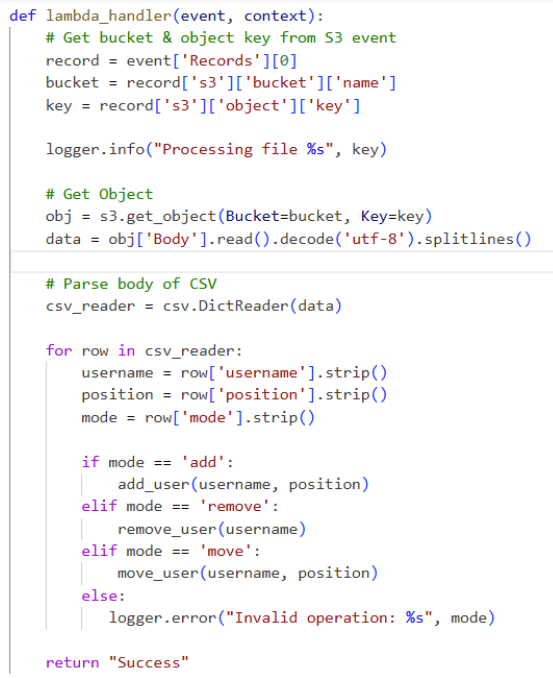

# IAM Identity Automation - Joiner/Mover/Leaver Pipeline (AWS)

## Overview 

The automation follows a straightforward event-driven pattern: 

CSV File upload -> S3 Bucket -> Lambda -> IAM Operations -> CloudTrail -> CloudWatch Logs -> Metric Filters -> Alarms -> SNS Email

## 🚀 Key Capabilities

- Automated user provisioning based on CSV input.
- Group assignment and reassignment for role changes.
- Automated deprovisioning including group reassignment and user deletion.
- Full audit trial through CloudTrail log streaming.
- Operational monitoring with CloudWatch metric filters.
- Email alerts for sensitive identity events via SNS.

## 🛠️ Architecture Components

* **Amazon S3** - Stores CSV file and triggers the workflow 
* **AWS Lambda (Python)** - Parses input and performs IAM operations
* **AWS IAM** - Users, groups, and permissions
* **AWS CloudTrial** - Captures all IAM API activity 
* **CloudWatch Logs** - Stores structured CloudTrial events
* **Metric Filters** - Detect specific identity-related actions 
* **CloudWatch Alarms** - Notify when monitored events occur
* **SNS** - Sends email alerts 

## 📁 CSV Format 

```csv
username,position,mode
daniel,dev,add
sarah,security,add
samuel,readonly,add
sarah,readonly,move
samuel,security,remove
daniel,security,move
```
- **username** is name of the user
- **position** maps to IAM groups
- **mode** determines the lifecycle action/operation 

## S3 Event Notification


S3 bucket configuration that triggers the Lambda function whenever a CSV file is uploaded. 

## Lambda Function


Lambda function used for processing the CSV file and performing IAM operations. 


Before deploying the function onto my Cloud Environment I ran various tests with sample CSV files through the lambda console.


Once deployed, using a CloudWatch log query tool, I could confirm that each joiner, mover and leaver action was executed successfully. 

## IAM Users Created by Automation and Group Memberships

Solarized dark                                       |  Solarized Ocean
:---------------------------------------------------:|:---------------------------------------------------:
  |  

<p float="left">
  
   
</p>

This screenshot shows the IAM console with users created automatically from the CSV input. This verifies that the automation process is functioning as expected. All users are in their respective IAM group memberships, a good signal that the system correctly assigns, moves and removes users.

## CloudTrail IAM Activity Record


All CloudTrail events that captured IAM actions performed by automation are stored and sent to a respective bucket, therefore all identity changes are fully auditable and traceable which is a very important concept in real enterprise environments.

## CloudWatch Metric Filters


CloudWatch metric filters I configured to detect specific IAM events inside CloudTrail logs. This represents a monitoring layer of the system and proves that the automation is performing identity changes as well as exposing them to observability.

## CloudWatch Alarm Configuration


This image displays the CloudWatch alarm I created to notify when a user is added to a group. For simplicity I have only made one with this simple condition. A more common use of this would be to monitor everytime a user is added to any sensitive groups or administrative roles.

## SNS Event Notification


This is a screenshot of the SNS email notification generated when the event triggered. It demonstrates the final step of the monitoring workflow. 
