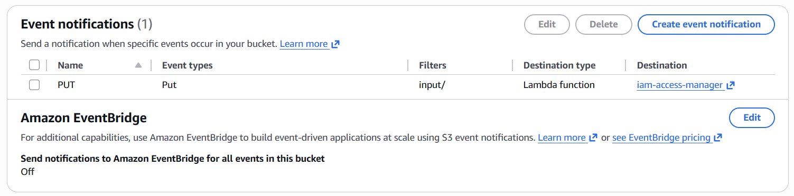
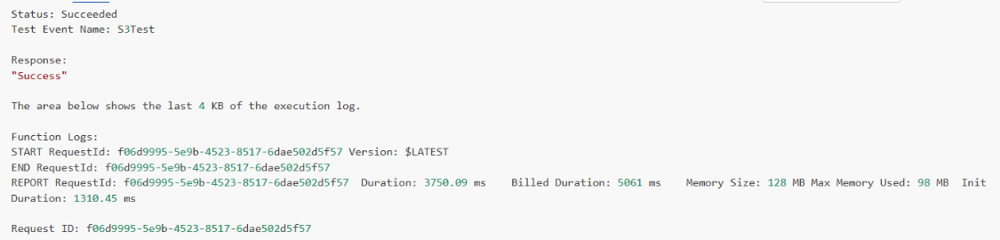
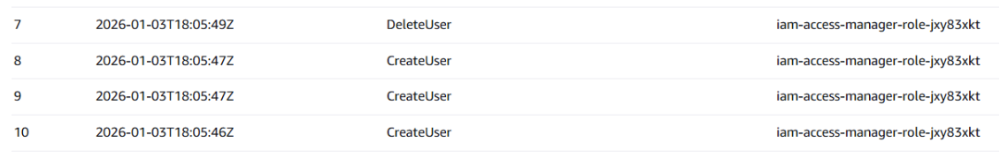
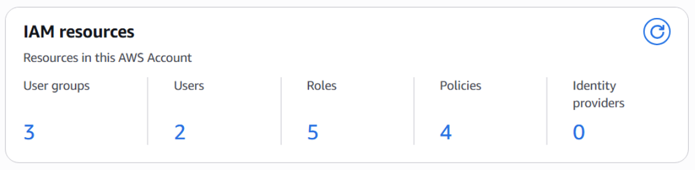
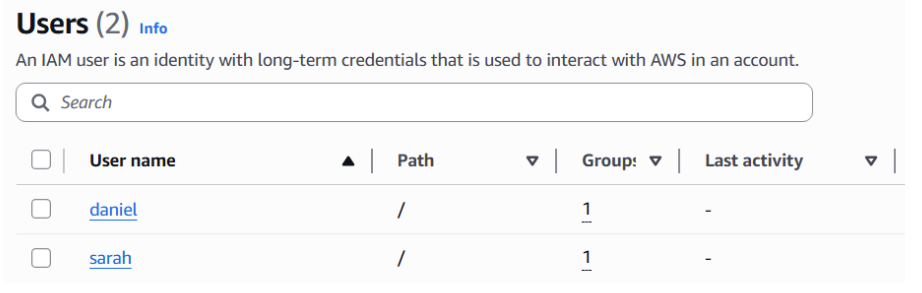
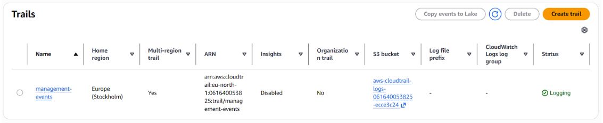
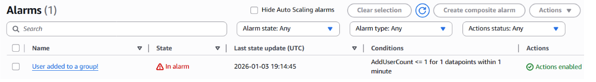
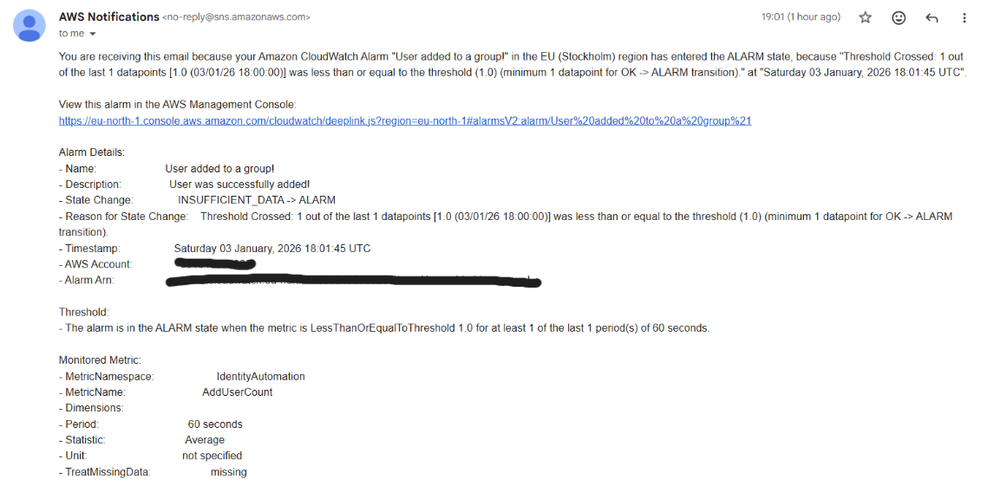

# IAM Identity Automation - Joiner/Mover/Leaver Pipeline (AWS)

## Overview 

This project uses AWS to implement an event-driven IAM Joiner–Mover–Leaver (JML) automation pipeline. Using native AWS services, the system makes identity lifecycle management observable, auditable, and controlled. A Lambda-based workflow is used to automatically execute user lifecycle actions that are defined declaratively via a CSV file. Both operational effectiveness and security visibility are provided by the logging, monitoring, and alerting of all identity changes.

The automation adheres to a simple, event-driven pattern: 

1) CSV Upload (S3 Bucket)
3) AWS Lambda (IAM Automation Script)
4) AWS IAM  
5) AWS CloudTrail (Audit Log)
6) CloudWatch Logs 
7) Metric Filters 
8) Cloudwatch Alarms 
9) SNS Email

---

## Key Capabilities

- Automated user provisioning based on CSV input.
- Group assignment and reassignment for role changes.
- Automated deprovisioning including group reassignment and user deletion.
- Full audit trial through CloudTrail log streaming.
- Operational monitoring with CloudWatch metric filters.
- Email alerts for sensitive identity events via SNS.

---

## Architecture Components

* **Amazon S3** - Stores CSV file and triggers the workflow 
* **AWS Lambda (Python)** - Parses input and performs IAM operations
* **AWS IAM** - Users, groups, and permissions
* **AWS CloudTrial** - Captures all IAM API activity 
* **CloudWatch Logs** - Stores structured CloudTrial events
* **Metric Filters** - Detect specific identity-related actions 
* **CloudWatch Alarms** - Notify when monitored events occur
* **SNS** - Sends email alerts 

---

## CSV Format 

```csv
username,position,mode
daniel,dev,add
sarah,security,add
samuel,readonly,add
sarah,readonly,move
samuel,security,remove
daniel,security,move
```
- **username** is name of the user
- **position** maps to IAM groups
- **mode** determines the lifecycle action/operation 

---

## S3 Event Notification



S3 bucket configuration that triggers the Lambda function whenever a CSV file is uploaded. 

---

## Lambda Function

```python 
def lambda_handler(event, context):
    # Get bucket & object key from S3 event
    record = event['Records'][0]
    bucket = record['s3']['bucket']['name']
    key = record['s3']['object']['key']

    logger.info("Processing file %s", key)

    # Get Object 
    obj = s3.get_object(Bucket=bucket, Key=key)
    data = obj['Body'].read().decode('utf-8').splitlines()

    # Parse body of CSV
    csv_reader = csv.DictReader(data)

    for row in csv_reader:
        username = row['username'].strip()
        position = row['position'].strip()
        mode = row['mode'].strip()

        if mode == 'add':
            add_user(username, position)
        elif mode == 'remove':
            remove_user(username)
        elif mode == 'move':
            move_user(username, position)
        else:
           logger.error("Invalid operation: %s", mode) 

    return "Success"
```

Lambda function used for processing the CSV file and performing IAM operations. 


Before deploying the function onto my Cloud Environment I ran various tests with sample CSV files through the lambda console. Note: I kept getting errors on my testing runs because of runtime errors. I fixed this by manually increasing the timeout timer. 


Once deployed, using a CloudWatch log query tool, I could confirm that each joiner, mover and leaver action was executed successfully. 

**Query**:
```SQL
SELECT
  eventtime,
  eventname,
  useridentity.invokedby,
  useridentity.sessioncontext.sessionissuer.username
FROM cloudtrail_logs_aws_cloudtrail_logs_061640053825_ecce3c24
WHERE
  eventsource = 'iam.amazonaws.com'
  AND eventname IN ('CreateUser', 'DeleteUser')
ORDER BY eventtime DESC;
```

---

## IAM Users Created by Automation and Group Memberships

<p float="left">
  
   
</p>

These screenshots show the IAM console with users created automatically from the CSV input. This verifies that the automation process is functioning as expected. All users are in their respective IAM group memberships, a good signal that the system correctly assigns, moves and removes users.

---

## CloudTrail IAM Activity Record


All CloudTrail events that captured IAM actions performed by automation are stored and sent to a respective bucket, therefore all identity changes are fully auditable and traceable which is a very important factor in real enterprise environments.

---

## CloudWatch Metric Filters


CloudWatch metric filters I configured to detect specific IAM events inside CloudTrail logs. This represents a monitoring layer of the system and proves that the automation is performing identity changes as well as exposing them to observability.

---

## CloudWatch Alarm Configuration


This image displays the CloudWatch alarm I created to notify when a user is added to a group. For simplicity I have only made one with this simple condition. A more common use of this would be to monitor everytime a user is added to any sensitive groups or administrative roles.

---

## SNS Event Notification


This is a screenshot of the SNS email notification generated when the event triggered. It demonstrates the final step of the monitoring workflow. 

---

## Issues This System Solves

- Prevents manual IAM user management
- Eliminates inconsistent access assignments
- Provides full auditability and traceability for identity changes
- Allows real-time monitoring of sensitive IAM actions
- Improves security posture through visibility and alerts

---

## Further Improvements I Would Like To Implement

- Replace CSV input with API Gateway or HR system integration, I think this would make it feel more real
- Integrate AWS IAM Identity Center
- Add dashboards for IAM activity trends
- Explore more AWS functions to further develop infrastructure like Terraform or CloudFormation

---

## Disclaimer

All sensitive information (API keys, credentials, IP addresses, and subscription details) has been redacted.

---

**Author**: [Daniel Krakolinig] 

**Version**: 1.1

**Last Updated**: January 2026
